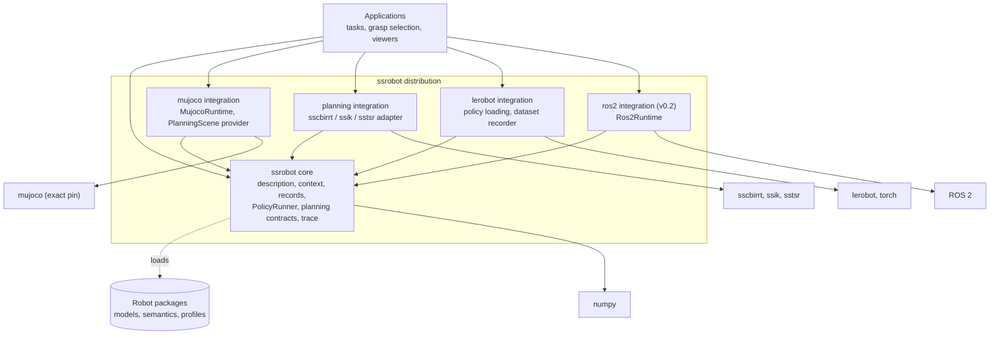

# ssrobot architecture and charter

ssrobot is a small, simulator-neutral robot interface. It gives planners, learned
policies, teleoperators, and recorders one shared way to describe a robot, observe it,
command it, and trace what happened, whether the robot is replayed, simulated in
MuJoCo, or physical hardware.

ssrobot owns the *contract* between those clients and backends. It does not own the
algorithms on either side of it.

This document is normative for scope, ownership, and the architecture decisions listed
below. Exact types and schemas are specified by the M0 contract issues (#2–#5) and
their checked-in artifacts; the code examples here are illustrative.

## Core concepts

| Concept | Role |
| --- | --- |
| `RobotDescription` | Immutable, validated semantic model of a robot: joints, links, frames, groups, manipulators, bases, end effectors, sensors, declared capabilities. Safe to share across contexts. |
| `RobotContext` | The public session. Context-managed; the only path through which users observe, submit commands, step, snapshot, and close. |
| `Runtime` | Injected backend mechanics (replay, MuJoCo, ROS 2). Owns I/O, lifecycle, status, and capability reporting. Contains no planning or task logic. |
| `Execution` | Passive handle returned by `submit`. Owns no thread, loop, or clock. |
| `SceneSnapshot` | Immutable, serializable scene state. |
| `PlanningScene` | Neutral capability a runtime materializes from a snapshot: forward kinematics, state and edge validity, optional collision detail. Isolated and timeless. |
| Trace | Versioned JSONL record of everything a context did, with content-addressed external assets. |

## User journeys

All three journeys use the same robot package, context, command types, and trace. A
client that works in one runtime works in another by changing only the runtime
argument.

### Planning only

```python
import ssrobot
from ssrobot.mujoco import MujocoRuntime            # `mujoco` extra
from ssrobot.planning import CBiRRT                 # `planning` extra

robot = ssrobot.load_package("geodude")             # immutable RobotDescription
with ssrobot.RobotContext(robot, MujocoRuntime(scene="tabletop.xml")) as ctx:
    arm = ctx.manipulator("right")                  # explicit; there is no active arm
    plan = arm.plan_to_end_effector_pose(goal, planner=CBiRRT(seed=0))
    execution = ctx.submit(plan.trajectory)         # validated and scheduled, not run
    result = ctx.run_until(execution)               # steps the manual clock to a terminal state
```

No learning dependency is installed or imported.

### Policy only

```python
from ssrobot import PolicyRunner
from ssrobot.lerobot import load_policy             # `lerobot` extra

policy = load_policy("checkpoints/act-tiny")
with ssrobot.RobotContext(robot, MujocoRuntime(scene="tabletop.xml")) as ctx:
    runner = PolicyRunner(ctx, policy, rate_hz=30)  # schemas negotiated before any motion
    episode = runner.run_episode(max_steps=300)     # observe → infer → validate → submit → step
```

No planner is installed or imported.

### Hybrid

```python
with ssrobot.RobotContext(robot, MujocoRuntime(scene="tabletop.xml")) as ctx:
    ctx.add_sink(recorder)                          # optional LeRobotDataset recorder
    arm = ctx.manipulator("right")
    approach = arm.plan_to_tsr(pregrasp, planner=CBiRRT(seed=0))
    ctx.run_until(ctx.submit(approach.trajectory))  # planner-produced commands own the arm…
    PolicyRunner(ctx, grasp_policy).run_episode()   # …then ownership passes to the policy
```

The trace records, per step, whether a command came from a planner, a policy, or a
human or scripted source.

### Moving to hardware (v0.2)

Replace `MujocoRuntime(...)` with `Ros2Runtime(profile=...)`. Hardware is externally
clocked: `run_until` and `PolicyRunner` wait for timestamped updates instead of
stepping, and `ctx.step()` is unavailable. Nothing else in the client changes.

## Ownership

| Responsibility | Owner | ssrobot's role |
| --- | --- | --- |
| Robot semantics, identity, naming | ssrobot core | Owns `RobotDescription` and semantic entities |
| Frames, units, time, revisions | ssrobot core | Owns conventions and their validation |
| Observations, commands, executions, capabilities | ssrobot core | Owns typed records, schemas, and validation |
| Lifecycle, ownership, cancellation, faults | ssrobot core | Owns semantics; runtimes implement them |
| Execution traces | ssrobot core | Owns JSONL trace format |
| Robot models and assets | Robot packages (e.g. `geodude_assets`, `ada_assets`) | Defines the portable package manifest and loads it |
| Kinematics and IK | `ssik`; FK via `PlanningScene` providers | Translates groups and frames |
| Pose constraints (TSRs) | `sstsr` | Carries constraints in planning requests |
| Motion planning | `sscbirrt`; future planner adapters | Defines neutral requests/results; adapts |
| Physics and collision | MuJoCo; `sscbirrt` native collision scene | Runtime and `PlanningScene` provider adapters |
| Hardware transport | ROS 2 and existing Geodude controllers | `Ros2Runtime` adapter (v0.2) |
| Real-time safety, e-stops, watchdogs | Hardware controllers | Coordinates with, never replaces |
| Policy models and training | LeRobot, Torch | Optional adapter; `PolicyRunner` drives inference timing only |
| Datasets | LeRobotDataset | Optional recorder mapped from the trace |
| Visualization | Applications (e.g. `mj_viser` in user-controlled sync mode) | Exposes synchronous observation and trace sinks |
| Task logic, grasp selection, sequencing | Applications | None |

## Classifying a proposed feature

Apply these questions in order. The first “yes” decides.

1. **Does it reimplement something an owner above already provides** (an IK solver, a
   planner, a physics engine, a trainer, a transport, a safety system)? → **Out of
   scope.** Contribute it to the owning package instead.
2. **Is it specific to one robot, task, scene, grasp strategy, or user interface?** →
   **Application** (or robot-package data).
3. **Does it require a backend or third-party library** (MuJoCo, sscbirrt, ssik,
   sstsr, LeRobot, Torch, ROS 2, a viewer)? → **Adapter**, behind a namespaced
   subpackage and an extra.
4. **Do at least two independent consumers** (planning clients, policy clients,
   runtimes, recorders) **need it to agree on meaning, and is it expressible with the
   core dependencies?** → **Core.**
5. Otherwise → **Out of scope** until a second consumer exists.

Examples: joint-order validation is core (4); `plan_to_tsr` request construction is
core (4) and its solver is an adapter (3); a MuJoCo camera mapping is an adapter (3);
choosing grasp candidates is application (2); a viewer is application (2); a new
TSR sampler is out of scope (1).

## Dependency direction



Rules:

- Core imports only the standard library and NumPy. It never imports an integration.
- Integrations depend on core, not on each other. The one sanctioned exception is the
  optional native lowering between the MuJoCo `PlanningScene` provider and the
  sscbirrt adapter, active only when both extras are installed (#18, #22).
- Applications may depend on anything. Nothing in the distribution depends on an
  application.
- CI verifies these edges by importing core and each extra in clean environments.

## Architecture decisions (normative for v0.1)

- **Time.** Simulation is synchronous and client-stepped (`ClockMode.MANUAL`);
  hardware is externally clocked (`ClockMode.EXTERNAL`). Clock mode is a declared
  runtime capability. One `step()` advances one control tick, with a fixed, declared
  number of physics substeps. The core has no asyncio API and owns no hidden
  simulation, viewer, or inference thread. Real-time loops are application drivers
  over `step()`.
- **Execution.** `submit(command)` returns a passive `Execution`. Progress happens only
  when time advances: by `step()` on manual runtimes, by external updates otherwise.
  `run_until` is a blocking convenience over either. Both clock modes share one
  terminal-state vocabulary.
- **Snapshots.** `SceneSnapshot` is immutable data. Runtimes materialize it as a
  neutral, isolated `PlanningScene`. The MuJoCo provider reuses sscbirrt's native
  scene, snapshot, and attachment-aware checker rather than duplicating them.
- **Records.** Public values are frozen, slotted, keyword-only stdlib dataclasses with
  strict hand-written ingress validation; no Pydantic or msgspec in core. Checked-in
  JSON Schema describes their wire form and CI rejects drift. Every wire record
  carries a schema name and version.
- **Traces.** JSONL records with `schema`, `version`, `sequence`, `kind`, `clock`,
  `time_ns`, `source`, and `payload`. Images and large arrays are stored separately
  and referenced by relative path and content hash. LeRobotDataset is a mapping from
  the trace, not a replacement for it.
- **Packaging.** One `ssrobot` distribution, managed with uv, requiring Python 3.11+
  (stdlib `tomllib`). Extras: `mujoco`, `planning`, `lerobot`, and in v0.2 `ros2`; no
  `all` extra. The `mujoco` and `planning` extras resolve the exact MuJoCo version
  sscbirrt's native adapter is built against (currently 3.14.0).
- **Visualization** is an application concern over synchronous observation and trace
  sinks. Core exposes no viewer object or GUI lifecycle.
- **No implicit state.** No global active context, manipulator, runtime, viewer, or
  event loop. Every selection is explicit; ambiguity is an error, never a fallback.
- **Reference fixtures.** Geodude and ADA (Kinova JACO) are the two full reference
  robots. A pinned MuJoCo Menagerie Franka is a lightweight parser and inspection
  fixture only.

## Anti-bloat rules

- Every public abstraction needs two credible consumers or a documented near-term
  necessity. Speculative extension points are not added.
- No plugin framework, registry, event bus, task language, TF replacement, or
  universal sensor ontology. Adapters are small protocols.
- Adapters translate; they do not reimplement the algorithms they wrap.
- Backend-specific options stay namespaced in the adapter, not in neutral signatures.
- Capabilities are declared and negotiated up front. Missing capabilities fail with a
  typed diagnostic instead of degrading silently.
- **Every extraction retires legacy code.** Behavior moved into ssrobot from
  `mj_manipulator`, `mj_environment`, the asset manager, or `HardwareContext` must be
  deleted or deprecated in its source repository through a linked migration PR, once
  equivalent behavior and a rollback path are verified.

## Non-goals

- Choosing or implementing planning, IK, constraint, control, or policy algorithms.
- Training models, managing experiments, or defining rewards and episode termination.
- A plugin framework, task language, TF replacement, or universal sensor ontology.
- Grasp selection, pickup-and-place sequencing, or other task skills in core.
- Replacing hardware safety systems, e-stops, or certified controllers; claiming
  safety certification or unattended autonomy.
- A public asyncio API, distributed scheduler, or remote package manager.
- Physical deployment in v0.1.

## Releases

- **v0.1 — simulation first** (M0–M5). Contracts, robot loading, MuJoCo runtime,
  planning, policies, recording, and planning-only, policy-only, and hybrid Geodude
  workflows in simulation, with legacy simulation code migrated.
- **v0.2 — physical Geodude** (M6). `Ros2Runtime`, hardware profiles and calibration,
  guarded execution, shadow mode, physical policy rollout and recording, and
  migration from `HardwareContext`. Simulation-only users keep v0.1's dependency
  boundaries.
